<div align="center">
  
</div>

<div align="center">
  <h3>把复杂系统做稳，把技术能力变成业务增长。</h3>
  <p>
    <a href="https://juejin.cn/user/1451011081249175">技术文章</a> ·
    <a href="https://www.1024bat.cn">个人博客</a> ·
    <a href="https://github.com/webVueBlog?tab=repositories">开源项目</a> ·
    <a href="https://webvueblog.github.io/JavaPlusDoc/">JavaPlusDoc</a>
  </p>
</div>

## 👋 关于我

我是 **哪吒（Jeskson）**，一名全栈架构师，长期专注于 **IoT、SaaS、微服务、高并发系统与 AI 应用工程化**。

我擅长从业务目标出发，完成产品从 **0 到 1 的架构设计、研发交付与持续演进**，并将技术能力转化为可衡量的业务成果。

| 🏗️ 从 0 到 1 | ⚡ 大规模系统 | 💰 商业化实践 |
| :---: | :---: | :---: |
| IoT、SaaS、电商与 AI 平台 | 百万级用户与设备、高并发数据处理 | 亿级营收系统建设与长期演进 |

> Full-stack architect specializing in **IoT, microservices, distributed systems, and AI-powered applications**. I build production systems that scale from idea to impact.

## 🧭 当前关注

```text
Device / Web / App
        ↓
  API & IoT Gateway
        ↓
Microservices · Event Streaming · AI Agents
        ↓
Data · Observability · Cloud Native
```

## 🧰 技术雷达

| 领域 | 技术 |
| --- | --- |
| 后端与架构 | `Java` `Go` `Spring Boot` `Spring Cloud` `Netty` `MySQL` `Redis` `Kafka` `RabbitMQ` `Elasticsearch` |
| 前端与客户端 | `Vue 3` `TypeScript` `Vite` `Node.js` `UniApp` `Flutter` |
| 云原生与效能 | `Docker` `Kubernetes` `Jenkins` `GitHub Actions` `Prometheus` `Grafana` `Nginx` |
| 探索方向 | `IoT` `分布式系统` `可观测性` `AI Agent` `RAG` `AI 应用工程化` |

## 🚀 精选项目

| 项目 | 方向 | 简介 |
| --- | --- | --- |
| [da-mqtt](https://github.com/webVueBlog/da-mqtt) | IoT | MQTT Broker 与物联网消息通信实践 |
| [Springboot-IOT-Platform](https://github.com/webVueBlog/Springboot-IOT-Platform) | IoT | Spring Boot IoT 平台 |
| [Springboot-IOT-Gateway](https://github.com/webVueBlog/Springboot-IOT-Gateway) | Gateway | IoT 设备接入与网关服务 |
| [bi-backend](https://github.com/webVueBlog/bi-backend) | AI / BI | 智能 BI 平台后端 |
| [springboot-cloud-push](https://github.com/webVueBlog/springboot-cloud-push) | Distributed | 分布式消息推送服务 |
| [Mall-system-Java-Vue-Uni-app](https://github.com/webVueBlog/Mall-system-Java-Vue-Uni-app) | Full Stack | Java、Vue 与 UniApp 商城系统 |

<details>
<summary><strong>展开更多项目</strong></summary>

<br />

| 项目 | 简介 |
| --- | --- |
| [Charging-pile-cloud-platform](https://github.com/webVueBlog/Charging-pile-cloud-platform) | 充电桩云平台 |
| [fastapi_plus](https://github.com/webVueBlog/fastapi_plus) | FastAPI 工程化实践 |
| [nice-js-leetcode](https://github.com/nice-people-frontend-community/nice-js-leetcode) | JavaScript 算法与 LeetCode 学习资料 |
| [websocketNetty](https://github.com/webVueBlog/websocketNetty) | 基于 Netty 的 WebSocket 通信实践 |

</details>

## 📡 找到我

- [掘金：我是哪吒](https://juejin.cn/user/1451011081249175)
- [技术博客：1024bat.cn](https://www.1024bat.cn)
- [技术博客：1024bibi.com](https://www.1024bibi.com)
- [GitHub 仓库与贡献](https://github.com/webVueBlog?tab=repositories)

---

<div align="center">
  <strong>Build for scale. Design for change. Ship for impact.</strong><br />
  如果你对 IoT、分布式架构、AI 应用或开源协作感兴趣，欢迎发起讨论。
</div>
